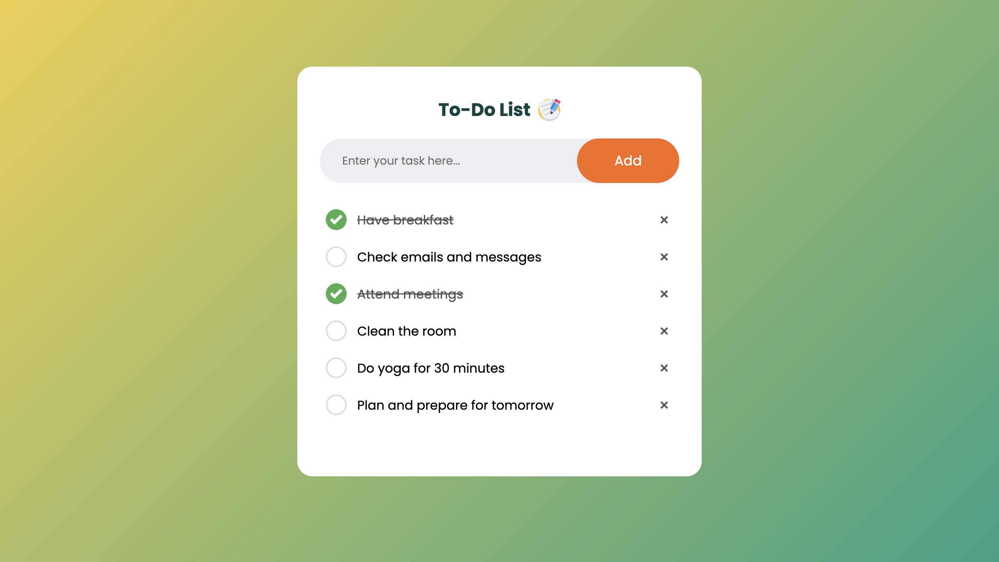

# Task Manager Application

## Overview

This is a Task Manager application built with HTML, CSS, and JavaScript. It allows users to add, check off, and delete tasks, while saving the task list to `localStorage` so that it persists across page reloads.

## Features

- Add new tasks to the list
- Check off tasks by clicking on them
- Remove tasks by clicking the "×" button
- Persist tasks across page reloads using `localStorage`

## Demo

You can view the live demo of this project by clicking the link below:

[Click here to view the demo](https://skylaryhu.github.io/To-Do-List-App-/)

## Screenshots

